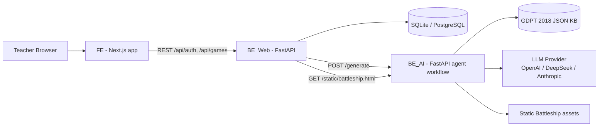
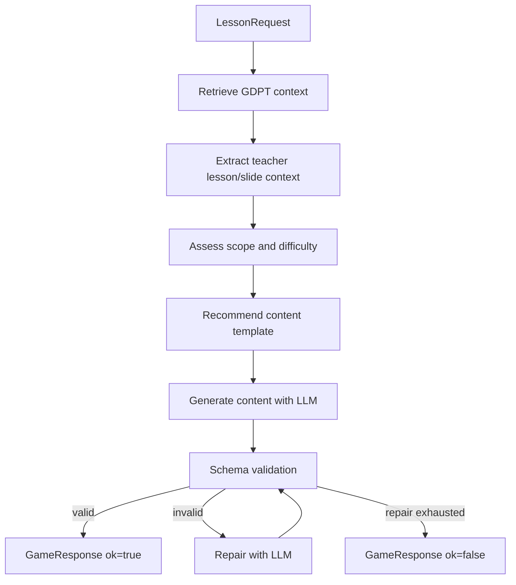
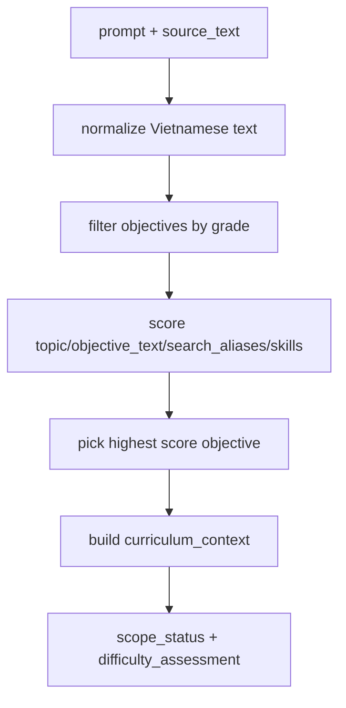
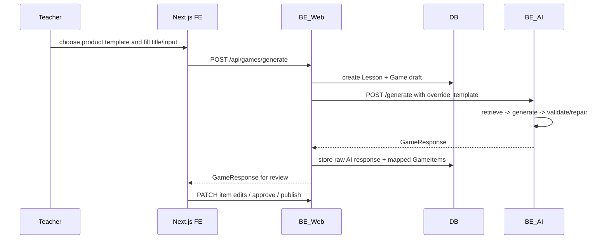

# Architecture

This document describes the current project architecture in this branch. The two source diagrams live in `docs/statics/` and are embedded below for PR review.

## Visual Architecture Diagram


The architecture has three runtime layers:

- **FE - Next.js**: teacher UI, game creation, validation/review screens, and playable shells.
- **BE_Web - FastAPI**: authentication, app persistence, game drafts, teacher edits, approval/publish workflow, and BE_AI orchestration.
- **BE_AI - FastAPI agent backend**: GDPT retrieval, teacher-context extraction, difficulty/scope assessment, template recommendation, LLM generation, validation, and repair.

Supporting systems:

- **DB**: SQLite locally or PostgreSQL in deployment.
- **GDPT 2018 JSON KB**: file-backed curriculum authority for primary Mathematics.
- **LLM provider**: OpenAI, DeepSeek, or Anthropic.

## Component Diagram Fallback



## Data Flow Diagram


The data-flow diagram shows the main request path:

1. Teacher enters `title`, `input`, `grade`, `subject`, and `difficulty`.
2. FE sends `POST /api/games/generate` to BE_Web.
3. BE_Web creates a `Lesson` and `Game` draft.
4. BE_Web calls BE_AI `/generate` with a `LessonRequest`.
5. BE_AI retrieves the GDPT objective and extracts teacher context.
6. BE_AI assesses scope/difficulty, recommends a content template, generates content with an LLM, then validates schema.
7. If valid, BE_AI returns `GameResponse ok=true`; if invalid, it repairs with the LLM until repair attempts are exhausted.
8. BE_Web stores the raw AI response and maps AI content into `GameItems`.
9. FE shows the teacher review screen.
10. Teacher can edit item content or approve/publish the game.

## Runtime Components

| Component | Path | Responsibility |
|---|---|---|
| FE | `FE/` | Teacher UI, template selection, game creation form, validation/review workspace, game shells. |
| BE_Web | `BE_Web/` | Auth, persistence, draft games, teacher review APIs, mapping AI content to app game items. |
| BE_AI | `backend/` | GDPT retrieval, teacher-context extraction, template recommendation, generation, schema validation, repair. |
| Runtime KB | `backend/data/gdpt_2018/` | JSON objectives loaded into BE_AI memory at startup/request runtime. |
| Canonical KB | `knowledge_base/gdpt_2018/` | Reviewable source documents and curated objectives for Toan grade 1-5. |
| DB | `BE_Web/be_web.db` by default | Users, lessons, games, game items, review events. |
| LLM Provider | external API | OpenAI, DeepSeek, or Anthropic tool-call generation. |

## BE_AI Agent Flow



Relevant code:

- `backend/app/retrieval/context.py`
- `backend/app/agents/graph.py`
- `backend/app/agents/recommender.py`
- `backend/app/agents/generator.py`
- `backend/app/validation/validator.py`

## Knowledge Base Retrieval Flow



The retrieval provider does not use vector search and does not ask an LLM to read all JSON files. It loads objectives from JSON into Python memory and uses heuristic matching.

Current scoring code:

```text
backend/app/retrieval/context.py::_match_objective()
```

Scoring signals:

- Exact phrase match in prompt/source text.
- Token overlap between query and objective fields.
- Alias/topic subset match.
- Direct `objective_id` match bypasses scoring and returns confidence `1.0`.

## BE_Web Game Creation Flow



Current BE_Web mappings:

| Product template | AI template | Mapper |
|---|---|---|
| `treasure_hunt` | `quiz` | `quiz_content_to_items` |
| `battleship` | `battleship` | `battleship_content_to_items` |

Current BE_Web behavior in this branch:

- It sends `lesson.grade` directly to BE_AI, so primary grades remain grade 1-5.
- It sends `lesson.input_text` as BE_AI `prompt`.
- It sends `lesson.input_text` as BE_AI `source_text`.
- It calls BE_AI `/generate`, not `/generate/full`.

## Teacher Review Flow

```mermaid
flowchart LR
    A[Generated draft] --> B[Validation page]
    B --> C[Teacher edits item]
    C --> D[PATCH /api/games/{game_id}/items/{item_id}]
    D --> E[Recheck item]
    E --> F[Approve game]
    F --> G[Publish game]
```

Persistence tables:

- `users`
- `lessons`
- `games`
- `game_items`
- `game_review_events`

## Data Contracts

### BE_AI `LessonRequest`

```json
{
  "subject": "Toan",
  "grade": 3,
  "difficulty": "medium",
  "prompt": "Tao game matching ve phep nhan la phep cong lap",
  "objective_id": "",
  "source_text": "Vi du: 3 gio tao, moi gio 4 qua",
  "uploaded_file_id": "slide_001",
  "upload_type": "slide",
  "num_items": 8,
  "override_template": "matching"
}
```

### BE_AI `GameResponse`

```json
{
  "ok": true,
  "template_id": "matching",
  "rationale": "...",
  "content": {},
  "objective_id": "math_3_multiplication_repeated_addition",
  "validation_errors": [],
  "repair_attempts": 0,
  "error": null
}
```

### BE_Web `GenerateGameRequest`

Current branch schema:

```json
{
  "title": "Math facts",
  "input": "Create a short multiplication game.",
  "product_template_id": "treasure_hunt",
  "num_items": 10,
  "subject": "General",
  "grade": 3,
  "difficulty": "medium",
  "objective_id": null
}
```

## Deployment Notes

Minimum service topology:

```text
FE -> BE_Web -> BE_AI
BE_Web -> SQLite/PostgreSQL
BE_AI -> LLM provider
BE_AI -> local JSON KB
```

For production, prefer:

- PostgreSQL for BE_Web.
- Strong `JWT_SECRET_KEY`.
- Backend-only storage for uploaded lesson files/slides.
- A real parser pipeline for PDF/DOCX/PPTX to populate `source_text`.
