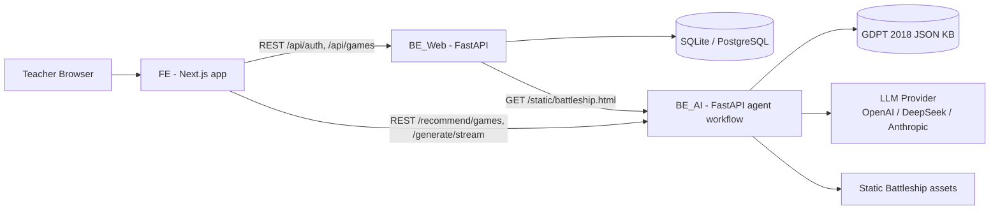
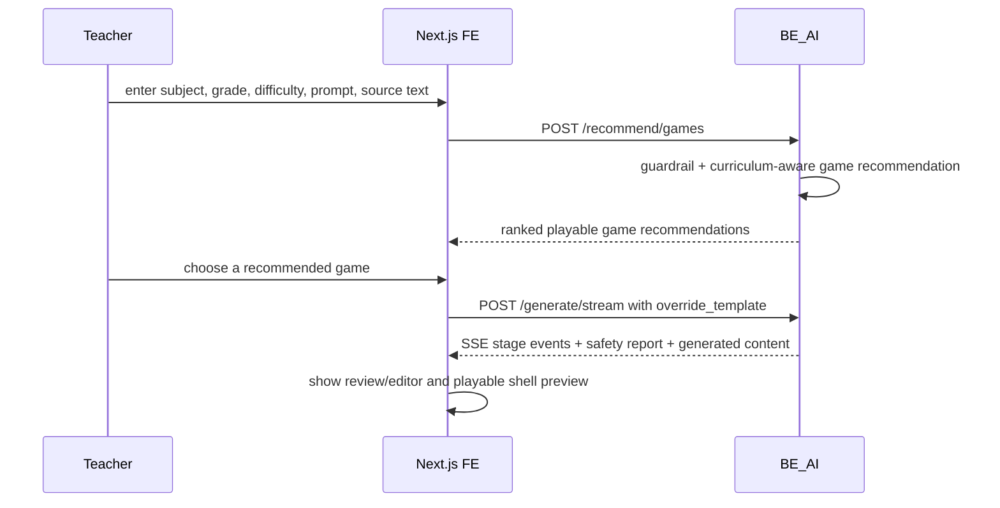
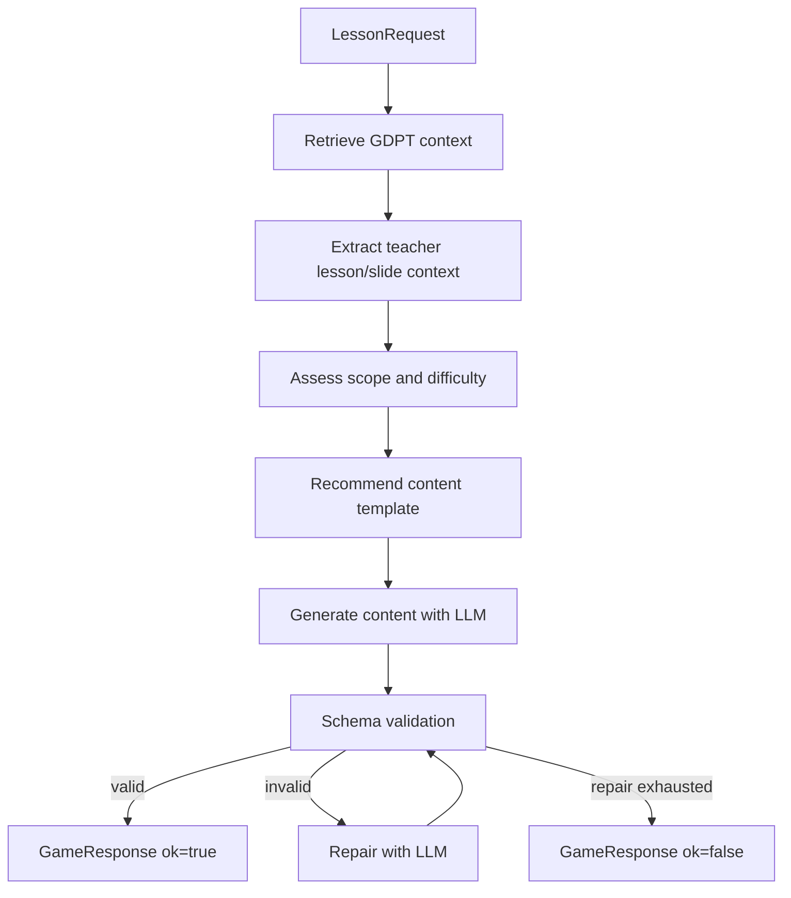
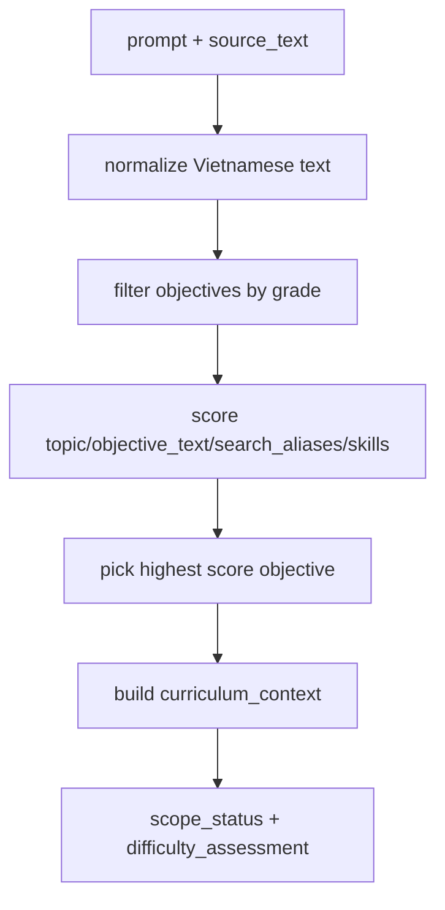
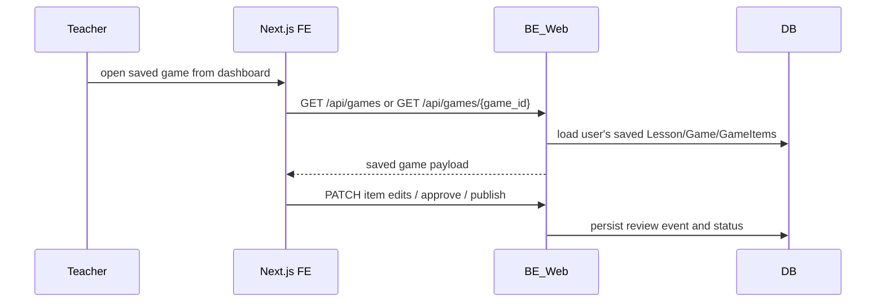

# Architecture

This document describes the current project architecture in this branch. The two source diagrams live in `docs/statics/` and are embedded below for PR review.

## Visual Architecture Diagram


The architecture has three runtime layers:

- **FE - Next.js**: teacher UI, game creation chat, recommendation selection, validation/review screens, and playable shells.
- **BE_AI - FastAPI agent backend**: guardrails, GDPT retrieval, teacher-context extraction, difficulty/scope assessment, game recommendation, streaming generation, validation, and repair.
- **BE_Web - FastAPI**: authentication, app persistence, saved games, teacher edits, approval/publish workflow, avatar upload, and static game serving.

Supporting systems:

- **DB**: SQLite locally or PostgreSQL in deployment.
- **GDPT 2018 JSON KB**: file-backed curriculum authority for primary Mathematics.
- **LLM provider**: OpenAI, DeepSeek, or Anthropic.

## Component Diagram Fallback



## Data Flow Diagram


The data-flow diagram shows the persisted BE_Web path. The current game-creation UI also has a newer direct BE_AI streaming path described below.

## Current FE Game Creation Flow



Current FE source:

- `FE/app/dashboard/game/new/page.tsx`
- `FE/src/features/game-creation/ai-api.ts`

Current BE_AI endpoints:

- `POST /recommend/games`
- `POST /generate/stream`
- `POST /generate/full`
- `POST /generate`

## Runtime Components

| Component | Path | Responsibility |
|---|---|---|
| FE | `FE/` | Teacher UI, game creation chat, recommendation selection, validation/review workspace, game shells. |
| BE_Web | `BE_Web/` | Auth, persistence, saved games, teacher review APIs, avatar upload, and static game serving. |
| BE_AI | `backend/` | Guardrails, GDPT retrieval, teacher-context extraction, game recommendation, streaming generation, schema validation, repair. |
| Runtime KB | `backend/data/gdpt_2018/` | JSON objectives loaded into BE_AI memory at startup/request runtime. |
| Canonical KB | `knowledge_base/gdpt_2018/` | Reviewable source documents and curated objectives for Toan grade 1-5. |
| DB | `BE_Web/be_web.db` by default | Users, lessons, games, game items, review events. |
| LLM Provider | external API | OpenAI, DeepSeek, or Anthropic tool-call generation. |

## BE_AI Agent Flow



Relevant code:

- `backend/app/retrieval/context.py`
- `backend/app/agents/graph.py`
- `backend/app/agents/recommender.py`
- `backend/app/agents/generator.py`
- `backend/app/validation/validator.py`

## Knowledge Base Retrieval Flow



The retrieval provider does not use vector search and does not ask an LLM to read all JSON files. It loads objectives from JSON into Python memory and uses heuristic matching.

Current scoring code:

```text
backend/app/retrieval/context.py::_match_objective()
```

Scoring signals:

- Exact phrase match in prompt/source text.
- Token overlap between query and objective fields.
- Alias/topic subset match.
- Direct `objective_id` match bypasses scoring and returns confidence `1.0`.

## BE_Web Saved-Game Review Flow



Current BE_Web behavior in this branch:

- It does not generate new games.
- It owns authentication, saved games, teacher edits, review events, approval, publishing, avatar upload, and static upload serving.
- Current FE game creation uses BE_AI `/recommend/games` and `/generate/stream`.

## Teacher Review Flow

```mermaid
flowchart LR
    A[Generated draft] --> B[Validation page]
    B --> C[Teacher edits item]
    C --> D[PATCH /api/games/{game_id}/items/{item_id}]
    D --> E[Recheck item]
    E --> F[Approve game]
    F --> G[Publish game]
```

Persistence tables:

- `users`
- `lessons`
- `games`
- `game_items`
- `game_review_events`

## Data Contracts

### BE_AI `LessonRequest`

```json
{
  "subject": "Toan",
  "grade": 3,
  "difficulty": "medium",
  "prompt": "Tao game matching ve phep nhan la phep cong lap",
  "objective_id": "",
  "source_text": "Vi du: 3 gio tao, moi gio 4 qua",
  "uploaded_file_id": "slide_001",
  "upload_type": "slide",
  "num_items": 8,
  "override_template": "matching"
}
```

### BE_AI `GameResponse`

```json
{
  "ok": true,
  "template_id": "matching",
  "rationale": "...",
  "content": {},
  "objective_id": "math_3_multiplication_repeated_addition",
  "validation_errors": [],
  "repair_attempts": 0,
  "error": null
}
```

## Deployment Notes

Minimum service topology:

```text
FE -> BE_Web -> BE_AI
BE_Web -> SQLite/PostgreSQL
BE_AI -> LLM provider
BE_AI -> local JSON KB
```

For production, prefer:

- PostgreSQL for BE_Web.
- Strong `JWT_SECRET_KEY`.
- Backend-only storage for uploaded lesson files/slides.
- A real parser pipeline for PDF/DOCX/PPTX to populate `source_text`.
