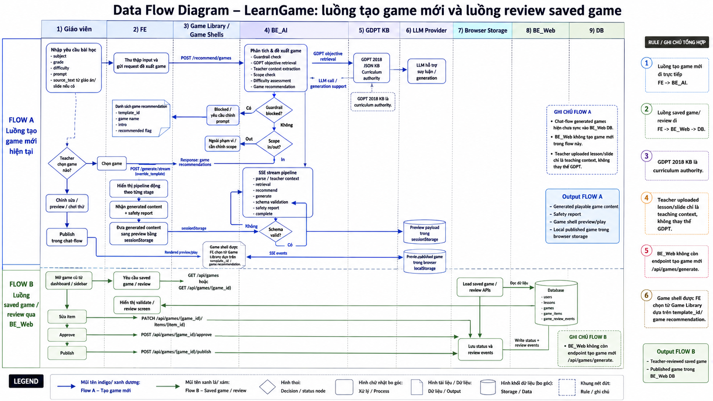

# Kiến Trúc LearnGame

Tài liệu này mô tả kiến trúc hiện tại của LearnGame theo hai sơ đồ mới trong `docs/statics/`:

- `learngame_architecture_diagram.svg`
- `dataflow_diagram.png`

## Sơ Đồ Architecture



Architecture hiện tại có các nhóm component chính:

- **Giáo viên / Trình duyệt**: nơi giáo viên nhập yêu cầu tạo game, chọn game, review và publish.
- **FE - Next.js**: giao diện tạo game dạng chat, chọn game recommendation, preview/edit/publish và render game shell.
- **Game Library / Game Shells**: nơi FE chọn game shell theo `template_id`, hiện có Treasure Hunt và Trivia Battleship.
- **Browser Storage**: FE dùng `sessionStorage` để truyền preview payload và `localStorage` để lưu game publish từ chat-flow.
- **BE_AI - FastAPI**: agent backend cho guardrails, GDPT retrieval, teacher context extraction, scope/difficulty assessment, game recommendation, streaming generation và schema validation.
- **GDPT 2018 JSON KB**: curriculum authority cho Toán tiểu học lớp 1-5.
- **LLM Provider**: OpenAI, DeepSeek hoặc Anthropic.
- **BE_Web - FastAPI**: auth, saved games, teacher review APIs, approve/publish, avatar upload và static serving.
- **DB**: PostgreSQL qua `DATABASE_URL`.

## Sơ Đồ Data Flow



Data flow hiện tại có hai luồng chính.

## Flow A - Luồng Tạo Game Mới

Luồng tạo game mới hiện đi qua BE_Web chat endpoints. BE_Web giữ lịch sử hội thoại, lưu game sinh ra vào DB, còn BE_AI chịu trách nhiệm guardrail, retrieval, recommendation và generation.

```text
Giáo viên -> FE -> BE_Web -> BE_AI -> GDPT KB / RAG / LLM -> BE_Web DB -> FE -> Game Library
```

Flow A có hai biến thể chung một contract:

```text
A1. Prompt-only
Giáo viên nhập subject/grade/difficulty/prompt
-> FE gọi BE_Web POST /api/chat/sessions/{id}/recommend
-> BE_Web gọi BE_AI POST /recommend/games với upload_type="none"
-> Giáo viên chọn game
-> FE gọi BE_Web POST /api/chat/sessions/{id}/generate
-> BE_Web gọi BE_AI POST /generate/stream
-> BE_Web lưu lesson/game/items vào DB

A2. Prompt + giáo án upload
Giáo viên chọn file PDF/TXT/DOCX
-> FE upload file lên BE_Web POST /api/uploads/lesson-file
-> BE_Web parse file thành source_text và trả uploaded_file_id
-> FE gửi prompt kèm source_text/uploaded_file_id/upload_type="lesson_plan"
-> BE_AI dùng source_text như teacher context, nhưng GDPT/RAG vẫn là curriculum authority
-> Các bước recommend/generate/lưu DB giống A1
```

Các bước chính:

1. Giáo viên nhập `subject`, `grade`, `difficulty`, `prompt`.
2. Nếu có giáo án, FE upload file `PDF`, `TXT` hoặc `DOCX` lên BE_Web để parse thành `source_text`.
3. FE gửi recommend request đến BE_Web. Với prompt-only, `upload_type="none"` và `source_text=null`. Với giáo án, gửi thêm `uploaded_file_id`, `upload_type="lesson_plan"`, `source_text`.
4. BE_Web lưu user prompt vào chat history rồi gọi BE_AI `/recommend/games`.
5. BE_AI chạy guardrail, GDPT objective retrieval, teacher context extraction nếu có `source_text`, scope check, difficulty assessment và game recommendation.
6. Nếu guardrail block hoặc scope không phù hợp, BE_AI trả thông tin để FE hiển thị cảnh báo/chỉnh prompt.
7. Nếu hợp lệ, BE_AI trả danh sách game recommendation gồm `template_id`, `game name`, `intro` và `recommended flag`.
8. Giáo viên chọn game.
9. FE gọi BE_Web `/api/chat/sessions/{id}/generate`; BE_Web gọi BE_AI `/generate/stream` với `override_template`.
10. BE_AI stream SSE events gồm teacher context/retrieval/recommend/generate/schema validation/safety/complete.
11. BE_Web lưu generated lesson/game/items vào DB và trả final event cho FE.
12. FE mở preview/review theo `lessonId/gameId`, dùng `template_id` để chọn game shell trong Game Library.

Ghi chú quan trọng:

- Prompt-only không đi qua parser upload.
- Teacher uploaded lesson file chỉ là teaching context, không thay thế GDPT 2018.
- BE_AI không nhận binary file; chỉ nhận text đã parse và metadata upload.
- `.doc` legacy chưa parse ổn định trong phase này; giáo viên nên lưu thành `.docx`, `.pdf` hoặc `.txt`.

## Flow B - Luồng Saved Game / Review Qua BE_Web

Luồng saved game/review đi từ FE sang BE_Web và DB.

```text
Giáo viên -> FE -> BE_Web -> DB
```

Các bước chính:

1. Giáo viên mở game cũ từ dashboard hoặc sidebar.
2. FE gọi `GET /api/games` hoặc `GET /api/games/{game_id}` đến BE_Web.
3. BE_Web đọc DB gồm `users`, `lessons`, `games`, `game_items` và `game_review_events`.
4. FE hiển thị validate/review screen.
5. Giáo viên sửa item.
6. FE gọi `PATCH /api/games/{game_id}/items/{item_id}`.
7. Giáo viên approve game.
8. FE gọi `POST /api/games/{game_id}/approve`.
9. Giáo viên publish game.
10. FE gọi `POST /api/games/{game_id}/publish`.
11. BE_Web lưu status và review events vào DB.

Ghi chú quan trọng:

- BE_Web không còn endpoint tạo game mới `/api/games/generate`.
- BE_Web hiện phục vụ auth, saved games, teacher review/edit APIs, approve/publish và static serving.

## Runtime Components

| Thành phần | Đường dẫn | Trách nhiệm |
|---|---|---|
| FE | `FE/` | UI giáo viên, game creation chat, recommendation selection, preview/review, game shell rendering. |
| Game Library | `FE/src/features/game-shells/` | Treasure Hunt, Trivia Battleship và các game shell/template active khác. |
| BE_AI | `backend/` | Guardrails, GDPT retrieval, teacher context, game recommendation, streaming generation, validation, repair. |
| BE_Web | `BE_Web/` | Auth, saved games, teacher review APIs, approve/publish, avatar upload, static serving. |
| Runtime KB | `backend/data/gdpt_2018/` | JSON objectives được BE_AI load khi chạy. |
| Canonical KB | `knowledge_base/gdpt_2018/` | Source documents và curated objectives để review/chỉnh sửa. |
| Browser Storage | `sessionStorage` / `localStorage` | Preview payload và local published games của chat-flow. |
| DB | PostgreSQL qua `DATABASE_URL` | `users`, `lessons`, `games`, `game_items`, `game_review_events`. |
| LLM Provider | API bên ngoài | OpenAI, DeepSeek hoặc Anthropic. |

## Luồng Retrieval Knowledge Base

BE_AI hiện không dùng vector search và không gọi LLM để đọc toàn bộ JSON. Hệ thống load objectives từ JSON vào Python memory và dùng heuristic matching.

Code tính score:

```text
backend/app/retrieval/context.py::_match_objective()
```

Các tín hiệu scoring:

- Exact phrase match trong `prompt` hoặc `source_text`.
- Token overlap giữa query và objective fields.
- Alias/topic subset match.
- `objective_id` nếu được truyền trực tiếp sẽ bypass scoring và trả confidence `1.0`.

## Data Contracts Chính

### BE_AI `LessonRequest`

```json
{
  "subject": "Toan",
  "grade": 3,
  "difficulty": "medium",
  "prompt": "Tao game matching ve phep nhan la phep cong lap",
  "objective_id": "",
  "source_text": "Vi du: 3 gio tao, moi gio 4 qua",
  "uploaded_file_id": "slide_001",
  "upload_type": "slide",
  "num_items": 8,
  "override_template": "matching"
}
```

### BE_AI `GameResponse`

```json
{
  "ok": true,
  "template_id": "matching",
  "rationale": "...",
  "content": {},
  "objective_id": "math_3_multiplication_repeated_addition",
  "validation_errors": [],
  "repair_attempts": 0,
  "error": null
}
```

## Ghi Chú Production

Khi production, nên ưu tiên:

- PostgreSQL cho BE_Web.
- `JWT_SECRET_KEY` mạnh.
- Backend-only storage cho giáo án/slide upload.
- Parser pipeline cho PDF/TXT/DOCX để tạo `source_text`; OCR/PPTX có thể là phase sau.
- Đồng bộ chat-flow generated games vào BE_Web DB nếu muốn lưu lịch sử trên nhiều thiết bị.
