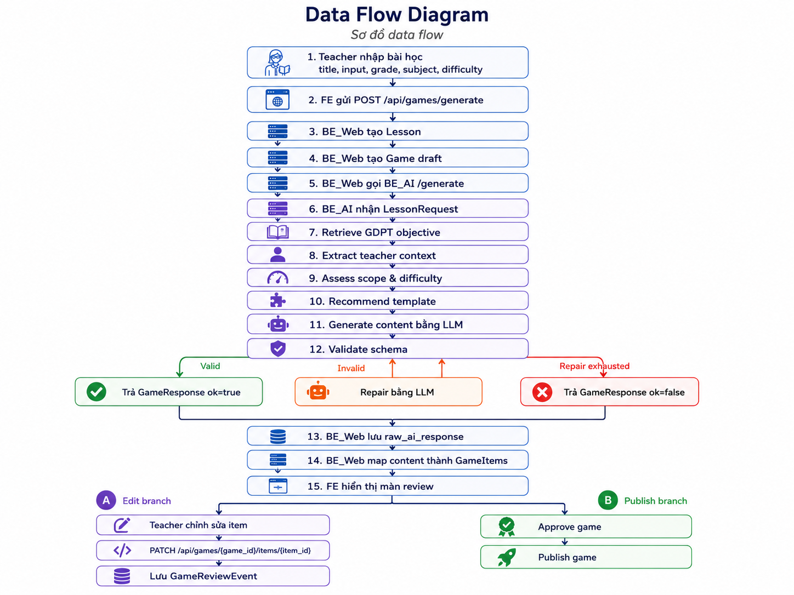

# Project Documentation

This folder contains the review documents for the LearnGame GDPT-aware game generator.

## Files

| File | Purpose |
|---|---|
| [ARCHITECTURE.md](ARCHITECTURE.md) | Component architecture and data-flow explanation. |
| [EVAL_EVIDENCE.md](EVAL_EVIDENCE.md) | Manual evaluation cases and local verification output. |
| [statics/architecture_diagram.svg](statics/architecture_diagram.svg) | Visual architecture diagram. |
| [statics/dataFlow.png](statics/dataFlow.png) | Visual end-to-end data flow diagram. |

## Diagram Preview

### Architecture

### Data Flow

